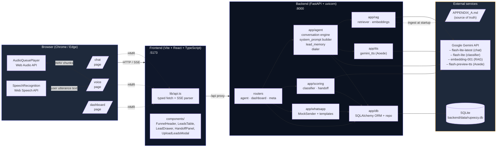
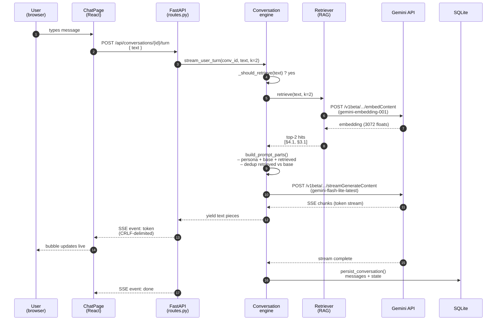
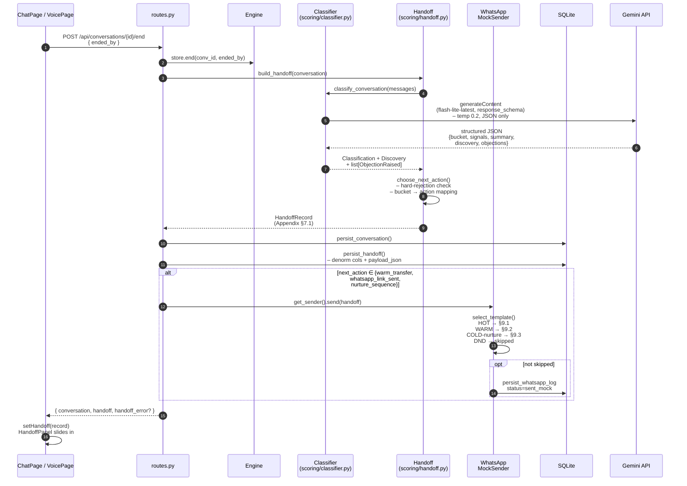
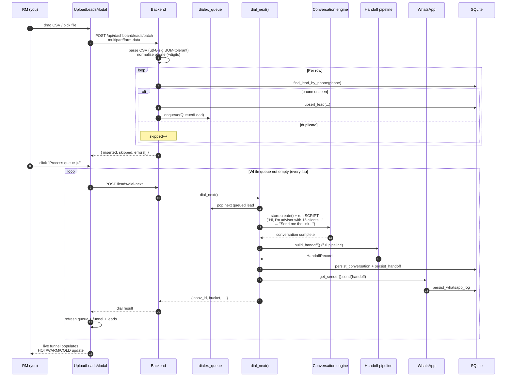
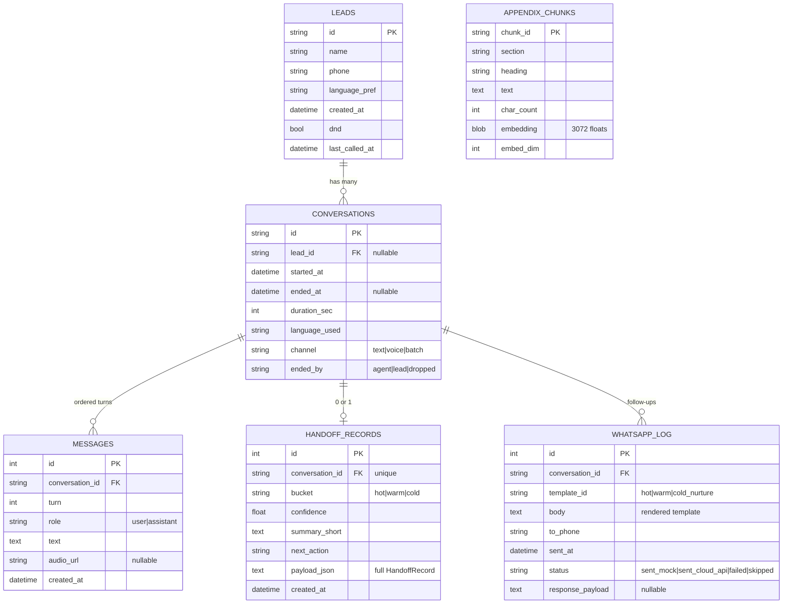
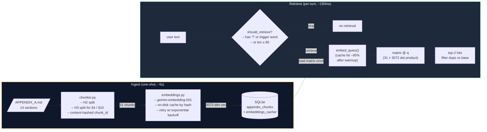
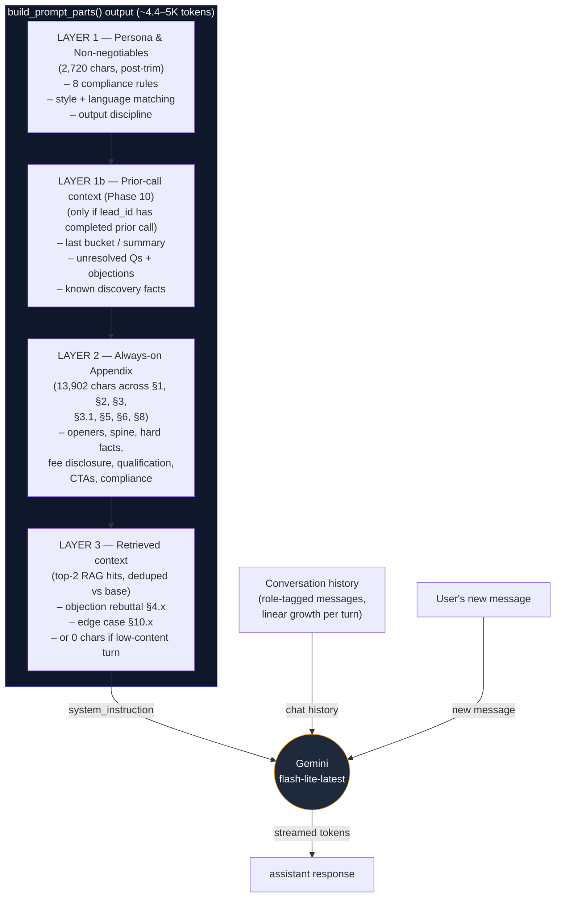

# Architecture — Rupeezy AI Voice Agent

> Complete graphical reference for the system. Every phase (0–10) shipped, plus
> Phase 6 voice (partial-deferred). All diagrams are GitHub-rendered Mermaid.
>
> Read this end-to-end after `README.md` and before `PLAN.md`. It's the single
> map between *"what does the codebase do"* and *"where does the bytes flow"*.

---

## 1. System overview — the boxes and the wires



**Two boundaries that matter:**

1. **Frontend ↔ Backend** — browser uses Vite's `/api` proxy in dev. Frontend
   never speaks to Gemini directly; the API key never leaves the server.
2. **Backend ↔ Gemini** — the only outbound network. Everything else is local
   (SQLite, Appendix-A markdown, in-process agent state).

---

## 2. Layer map — what lives where

```mermaid
flowchart TB
    subgraph L1[" Layer 1 — Client surfaces (3 demo pages) "]
        direction LR
        L1A["/chat<br/>SSE text stream"]
        L1B["/voice<br/>STT + Gemini Aoede TTS<br/>(deferred polish)"]
        L1C["/dashboard<br/>funnel · leads · drilldown"]
    end

    subgraph L2[" Layer 2 — Voice & Media (Phase 6) "]
        direction LR
        L2A["browser SpeechRecognition<br/>(STT, free)"]
        L2B["Web Audio API queue<br/>(gapless WAV playback)"]
        L2C["Gemini flash-preview-tts<br/>Aoede voice<br/>(per-sentence streaming)"]
    end

    subgraph L3[" Layer 3 — Conversation engine (Phases 2 + 10) "]
        direction LR
        L3A["stream_user_turn()<br/>Gemini chat with history<br/>+ system prompt + RAG hits"]
        L3B["build_prompt_parts()<br/>4 layers:<br/>persona / prior-call /<br/>base / retrieved"]
        L3C["lead_memory<br/>(cross-call context)"]
    end

    subgraph L4[" Layer 4 — Knowledge & Memory (Phase 1 + 4) "]
        direction LR
        L4A["RAG store<br/>31 chunks · 3072-dim<br/>cosine top-k"]
        L4B["Lead profile DB<br/>conversations · messages<br/>handoff_records · whatsapp_log"]
        L4C["APPENDIX_A.md<br/>(re-ingestable)"]
    end

    subgraph L5[" Layer 5 — Post-call pipeline (Phase 3 + 8) "]
        direction LR
        L5A["classify_conversation()<br/>Gemini structured output<br/>H/W/C + signals"]
        L5B["build_handoff()<br/>HandoffRecord (Appendix §7)"]
        L5C["choose_next_action()<br/>warm_transfer / WhatsApp /<br/>nurture / DND"]
        L5D["WhatsApp MockSender<br/>renders §9 template<br/>+ logs to DB"]
    end

    subgraph L6[" Layer 6 — Analytics & Dashboard (Phase 5 + 9) "]
        direction LR
        L6A["funnel_counts()<br/>contacted/engaged/qualified"]
        L6B["LeadDrawer<br/>handoff + transcript + WhatsApp"]
        L6C["UploadLeadsModal<br/>+ dialer worker"]
    end

    L1 --> L2
    L1 --> L3
    L2 --> L3
    L3 --> L4
    L3 --> L5
    L5 --> L4
    L4 --> L6
    L5 --> L6

    style L1 fill:#0F172A,stroke:#6366F1,color:#fff
    style L2 fill:#1E293B,stroke:#6366F1,color:#fff
    style L3 fill:#0F172A,stroke:#10B981,color:#fff
    style L4 fill:#1E293B,stroke:#F59E0B,color:#fff
    style L5 fill:#0F172A,stroke:#EF4444,color:#fff
    style L6 fill:#1E293B,stroke:#6366F1,color:#fff
```



The hackathon brief asked for these six layers. We shipped all of them.

---

## 3. End-to-end request flow — single chat turn

What actually happens when the user types `"I'm with Zerodha why switch?"`:



**Key facts:**

- Single turn = **2 outbound Gemini calls** (1 embed + 1 chat)
  - "hi" / one-word / no question marks → embedding skipped → just 1 call
- System prompt size is **~4.4–5K tokens** (post-Phase-7-optimization)
- First-token latency: **~1.0–1.5s** depending on retrieval cache hit
- Backend never blocks; all I/O is async

---

## 4. End-of-call pipeline — what `/end` does



**Why the chain is best-effort:**

- `/end` always succeeds the conversation close (status update + DB persist)
- Classifier / WhatsApp can fail — we log + return `handoff_error`, frontend
  still shows transcript even with no scoring
- A 429 on Gemini Pro → automatic flash-lite fallback (we made this primary
  in the perf pass)

---

## 5. Voice loop — Phase 6 (partial-deferred)

```mermaid
sequenceDiagram
    autonumber
    participant U as User<br/>(speaks)
    participant SR as SpeechRecognition<br/>(browser)
    participant V as VoicePage
    participant B as Backend
    participant E as Engine + sentence buffer
    participant TTS as Gemini Aoede<br/>flash-preview-tts
    participant AP as AudioQueuePlayer<br/>(Web Audio API)

    U->>SR: spoken utterance
    SR-->>V: onresult (final transcript)
    V->>B: POST /turn/audio<br/>{ text, language }
    B->>E: stream_user_turn_with_audio(...)

    loop For each text chunk from Gemini chat
        E-->>B: yield ("text", chunk)
        B-->>V: SSE event: token
        V->>V: transcript bubble updates

        E->>E: append to sentence buffer
        alt sentence_break detected (.!?:; or 90 chars)
            E->>TTS: synthesize(sentence, voice=Aoede)
            TTS-->>E: 24kHz PCM bytes
            E->>E: wrap in WAV header
            E-->>B: yield ("audio", wav_bytes)
            B-->>V: SSE event: audio (base64)
            V->>AP: enqueue(wavB64)
            AP->>AP: decodeAudioData → schedule<br/>at currentTime (gapless)
            AP-->>U: speaker
        end
    end

    Note over E,TTS: First audio plays<br/>~5–7s after user speaks<br/>(TTS-bound, not LLM-bound)
```

**What's deferred to Phase 11 polish:** the latency floor on
`gemini-2.5-flash-preview-tts` is ~5s/sentence and free-tier daily quota is
tight. Two options on the table — hybrid Aoede + browser-TTS fallback, or
swap to ElevenLabs for the demo recording. Either way, the *architecture*
above is what stays — only the TTS provider behind `app/tts/` changes.

---

## 6. Batch upload + dialer — Phase 9



**Why one-lead-per-HTTP-call instead of a true background worker:** Gemini
free-tier RPM is tight. A serial worker loops ~25-40s per lead. Driving
from the frontend with a 4s poll lets the user pause / stop, see live
progress in the funnel, and keeps the call fan-out under control.

---

## 7. Database schema (SQLAlchemy ORM)



**Two stores, one DB file.**

- `appendix_chunks` is the RAG vector index (separate from app data so it
  re-ingests independently).
- The 5 app tables form a tight tree from `Lead → Conversation → {Message,
  HandoffRow, WhatsappLog}`.
- `payload_json` on HandoffRecord is the source of truth; the denormalised
  columns (bucket, confidence, summary, next_action) are for fast dashboard
  filtering without parsing JSON.

---

## 8. RAG ingestion + retrieval



**Why this scales fine for a hackathon:**

- 31 chunks × 3072 floats = ~380KB in memory — load once at first query
- Cosine similarity on 31 chunks = sub-millisecond after embedding
- Embedding cache means re-running ingest on an unchanged Appendix is free
- 92% top-1 retrieval accuracy verified live (12-query test, see Phase 1)

---

## 9. System prompt — what we send Gemini per turn



**Phase 7 token-optimization stats** (per turn input):

| Scenario | Before | After | Cut |
|---|---|---|---|
| `"hi"` (no RAG) | 6,963 tok | **4,421 tok** | 36% |
| `"why switch from Zerodha?"` (k=2 RAG) | 9,924 tok | **5,035 tok** | 49% |
| `"what does it cost?"` (k=2 RAG, dedup) | 9,924 tok | **4,421 tok** | 55% |

---

## 10. File map — what's in each directory

```
rupeezy-voice-agent/
├── APPENDIX_A.md                    ← agent's source of truth (compressed)
├── PROJECT_CONTEXT.md               ← hackathon brief
├── PLAN.md                          ← 13-phase build plan + status tracker
├── ARCHITECTURE.md                  ← this file
├── README.md                        ← quick-start + tech stack
├── docker-compose.yml               (deleted — IndicF5 attempt reverted)
│
├── backend/                         ← FastAPI service, port 8000
│   ├── pyproject.toml               ← Python deps
│   ├── app/
│   │   ├── main.py                  ← lifespan, CORS, router include
│   │   ├── config.py                ← pydantic-settings env loader
│   │   ├── agent/                   ← Phase 2, 9, 10
│   │   │   ├── conversation.py      ← turn engine + history mgmt
│   │   │   ├── system_prompt.py     ← 4-layer prompt builder
│   │   │   ├── lead_memory.py       ← Phase 10: cross-call context
│   │   │   ├── dialer.py            ← Phase 9: scripted call worker
│   │   │   └── routes.py            ← /api/conversations/* endpoints
│   │   ├── rag/                     ← Phase 1
│   │   │   ├── chunker.py           ← H2/H3 markdown splitter
│   │   │   ├── embeddings.py        ← Gemini embedding client + disk cache
│   │   │   ├── store.py             ← SQLite chunk store
│   │   │   ├── retriever.py         ← top-k cosine
│   │   │   └── cli.py               ← `python -m app.rag.cli "..."`
│   │   ├── scoring/                 ← Phase 3
│   │   │   ├── schemas.py           ← Pydantic for HandoffRecord
│   │   │   ├── classifier.py        ← Gemini structured output
│   │   │   └── handoff.py           ← assembler + next-action chooser
│   │   ├── tts/                     ← Phase 6
│   │   │   └── gemini_tts.py        ← Aoede TTS + WAV wrapper
│   │   ├── whatsapp/                ← Phase 8
│   │   │   ├── __init__.py          ← public re-exports
│   │   │   └── sender.py            ← Mock + CloudApi senders, templates
│   │   ├── db/                      ← Phase 4
│   │   │   ├── engine.py            ← SQLAlchemy engine + session_scope
│   │   │   ├── models.py            ← 5 ORM models
│   │   │   └── repo.py              ← typed read/write helpers
│   │   ├── dashboard/               ← Phase 5 + 9
│   │   │   └── routes.py            ← /api/dashboard/* (funnel, leads, batch)
│   │   └── livekit/                 ← Phase 6 (kept empty stub)
│   ├── tests/                       ← 41 passing
│   │   ├── test_smoke.py
│   │   ├── test_chunker.py
│   │   ├── test_retrieval.py        (skipped without GEMINI_API_KEY)
│   │   ├── test_persistence.py
│   │   ├── test_handoff.py
│   │   ├── test_agent.py            (skipped without GEMINI_API_KEY)
│   │   ├── test_lead_memory.py      ← Phase 10
│   │   ├── test_whatsapp.py         ← Phase 8
│   │   └── test_batch_upload.py     ← Phase 9
│   └── data/                        ← gitignored — SQLite + cache
│
├── frontend/                        ← Vite + React + Tailwind, port 5173
│   ├── package.json
│   ├── vite.config.ts               ← proxy /api + /health → :8000
│   ├── tailwind.config.js           ← rupeezy theme tokens
│   └── src/
│       ├── main.tsx                 ← Router setup
│       ├── App.tsx                  ← landing page
│       ├── pages/
│       │   ├── chat.tsx             ← Phase 2: SSE text stream
│       │   ├── voice.tsx            ← Phase 6: STT + Aoede playback
│       │   └── dashboard.tsx        ← Phase 5 + 9: funnel + upload modal
│       ├── components/
│       │   ├── FunnelHeader.tsx     ← stages + bucket chips
│       │   ├── LeadsTable.tsx       ← row per lead
│       │   ├── LeadDrawer.tsx       ← drilldown + WhatsApp section
│       │   ├── HandoffPanel.tsx     ← shared between drawer + chat
│       │   ├── UploadLeadsModal.tsx ← Phase 9 batch upload
│       │   └── Placeholder.tsx
│       └── lib/
│           ├── api.ts               ← typed client + SSE parser
│           ├── speech.ts            ← Web Speech API shims
│           └── audioPlayer.ts       ← Web Audio queue (gapless WAV)
│
├── scripts/
│   ├── ingest_appendix.py           ← chunk + embed + write
│   ├── seed_demo_data.py            ← 15 fake leads for empty-DB demos
│   ├── demo_chat.py                 ← scripted scenarios
│   └── demo_handoff.py              ← end-to-end pipeline demo
│
└── demo_transcripts/                ← captured live runs
    ├── phase2.md                    ← English MFD scenario
    ├── phase3.md                    ← all 3 buckets H/W/C
    ├── phase7.md                    ← multilingual + mid-call switch
    ├── handoff_hot.json
    ├── handoff_warm.json
    └── handoff_cold.json
```

---

## 11. Phase coverage matrix


**Sustained tests:** 19 → 23 → 29 → 33 → **41 passing** (every phase added
its own coverage; no regressions).

---

## 12. What it costs to run a single demo end-to-end

For one full conversation: chat → end → handoff → WhatsApp:

| Step | API calls | Tokens (in) | Tokens (out) | Wall time |
|---|---|---|---|---|
| Open chat (no API hit) | 0 | – | – | <50ms |
| Turn 1 ("hi") | 1 chat | ~4.4k | ~80 | ~1.5s |
| Turn 2 (objection w/ ?) | 1 embed + 1 chat | ~5k | ~150 | ~2.5s |
| Turn 3 (cost question) | 1 embed + 1 chat | ~4.4k (dedup) | ~250 | ~2.5s |
| Turn 4 (close) | 1 embed + 1 chat | ~4.5k | ~80 | ~1.5s |
| End / classify | 1 chat (flash-lite) | ~3k | ~600 | ~5s |
| WhatsApp render | 0 (local) | – | – | <50ms |
| **Per conversation** | **~7 calls** | **~21k** | **~1.2k** | **~13s** |

For the dialer running 5 leads (queue processing): ~70s + 4s of poll
intervals = ~85s total wall time.

Free-tier daily quotas comfortably cover ~50 demo conversations / day on
this plan — well above what a hackathon recording session needs.

---

## 13. Mental model for the judges (3 sentences)

> The system is a **layered pipeline**, not a monolith: every turn passes
> through *retrieval → reasoning → persistence → optional notification*.
> The Appendix is the **single source of truth** — every fact-bearing claim
> retrieves a chunk before responding, and the chunks are content-hashed
> so swapping in an official Rupeezy script means rerunning one ingest
> command. The post-call **scoring stage is deliberately a separate model
> call** (different temperature, structured-output schema), so conversation
> quality and qualification quality optimize independently.
